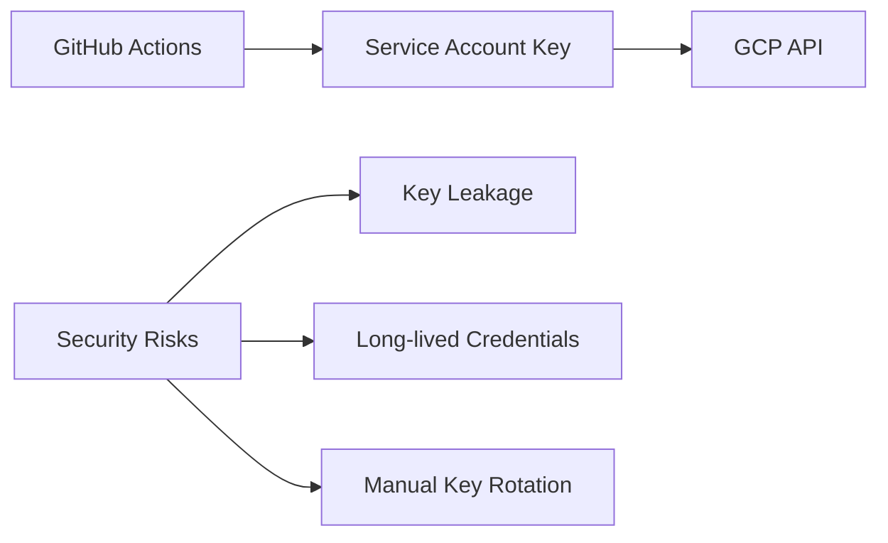
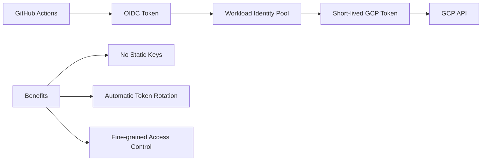

# 🚀 Secure Terraform Deployments to GCP with GitHub Actions: A Complete Workload Identity Federation Guide

*Published on: September 10, 2025*

## 📖 Introduction

In today's cloud-native world, Infrastructure as Code (IaC) has become the gold standard for managing cloud resources. However, securely connecting your CI/CD pipelines to cloud providers remains a critical challenge. Traditional approaches using static service account keys pose significant security risks, including credential leakage and long-lived access tokens.

This comprehensive guide demonstrates how to deploy Terraform infrastructure to Google Cloud Platform (GCP) using GitHub Actions with **Workload Identity Federation** – Google's recommended best practice for keyless authentication from external systems.

## 🎯 What You'll Learn

By the end of this guide, you'll have:
- A complete understanding of Workload Identity Federation
- A working POC that deploys GCP resources via Terraform from GitHub Actions
- Best practices for secure cloud deployments
- A reusable template for your own projects

## 🔐 Why Workload Identity Federation?

### Traditional Approach (❌ Not Recommended)


### Workload Identity Federation (✅ Recommended)


### Key Benefits:
- **🔒 Enhanced Security**: No long-lived credentials stored in GitHub
- **🔄 Automatic Rotation**: Tokens are short-lived and automatically renewed
- **📊 Better Auditing**: Clear attribution of actions to specific GitHub workflows
- **🎯 Fine-grained Control**: Restrict access to specific repositories, branches, or environments

## 🏗️ Architecture Overview

Our solution consists of several components working together:

1. **GCP Workload Identity Pool**: Manages external identities
2. **OIDC Provider**: Trusts GitHub's token issuer
3. **Service Account**: GCP identity with necessary permissions
4. **Terraform**: Infrastructure as Code tool
5. **GitHub Actions**: CI/CD workflow orchestrator

## 📋 Prerequisites

Before starting, ensure you have:
- A GCP project with billing enabled
- Admin access to the GCP project
- A GitHub repository
- `gcloud` CLI installed and authenticated
- Basic knowledge of Terraform and GitHub Actions

## 🛠️ Step 1: GCP Setup with Automated Script

I've created a comprehensive setup script that automates the entire GCP configuration process. This script handles all the complex IAM configurations and provides clear output for the next steps.

### Features of the Setup Script:
- ✅ Prerequisite checking
- ✅ Interactive configuration
- ✅ API enablement
- ✅ Service account creation
- ✅ Workload Identity Federation setup
- ✅ State bucket creation
- ✅ Configuration testing

### Running the Setup Script:

```bash
# Clone the repository
git clone <your-repo-url>
cd workload-pool

# Make the script executable
chmod +x scripts/setup-gcp.sh

# Run the setup script
./scripts/setup-gcp.sh
```

The script will prompt you for:
- **GCP Project ID**: Your target GCP project
- **GitHub Repository**: In format `username/repository-name`

### What the Script Creates:

1. **Service Account**: `github-actions-sa@<project-id>.iam.gserviceaccount.com`
2. **Workload Identity Pool**: `github-actions-pool`
3. **OIDC Provider**: `github-actions-provider`
4. **State Bucket**: `<project-id>-terraform-state`
5. **IAM Bindings**: Necessary permissions for Terraform operations

## 🔧 Step 2: Terraform Configuration

Our Terraform setup follows best practices with modular configuration:

### Project Structure:
```
terraform/
├── provider.tf      # Provider and backend configuration
├── variables.tf     # Input variables
├── main.tf         # Main resource definitions
└── outputs.tf      # Output values
```

### Key Features:
- **Remote State**: Stored securely in GCS bucket
- **Resource Tagging**: Consistent labeling for tracking
- **Lifecycle Management**: Automated cleanup policies
- **Versioning**: State file versioning enabled

### Sample Resources Created:
- **GCS Bucket**: With versioning and lifecycle policies
- **Sample Object**: Demonstrating successful deployment
- **Service Account**: (Optional) For VM instances

## 🚀 Step 3: GitHub Actions Workflow

Our CI/CD pipeline implements GitOps best practices:

### Workflow Features:
- **🔍 Pull Request Planning**: Automatic plan generation and PR comments
- **✅ Automated Validation**: Format, validation, and security checks
- **🚀 Automatic Deployment**: On merge to main branch
- **📊 Artifact Storage**: Terraform outputs saved as artifacts

### Security Features:
- **Minimal Permissions**: Only necessary GitHub token permissions
- **Environment Isolation**: Different configurations per environment
- **Audit Trail**: Complete logging of all operations

### Workflow Triggers:
- **Pull Requests**: Generates and comments Terraform plan
- **Push to Main**: Automatically applies changes
- **Manual Dispatch**: On-demand deployments

## 🎮 Step 4: Testing Your POC

### 1. Configure GitHub Secrets

After running the setup script, add these secrets to your GitHub repository:

```
Repository Settings > Secrets and variables > Actions
```

**Required Secrets:**
- `GCP_PROJECT_ID`: Your GCP project ID
- `GCP_SERVICE_ACCOUNT`: Service account email
- `GCP_WORKLOAD_IDENTITY_PROVIDER`: Full provider path

### 2. Create a Test Pull Request

```bash
# Create a new branch
git checkout -b test-deployment

# Make a small change to trigger the workflow
echo "# Test Change" >> terraform/main.tf

# Commit and push
git add .
git commit -m "test: Trigger workflow test"
git push origin test-deployment
```

### 3. Observe the Workflow

1. **Navigate** to your repository's Actions tab
2. **Watch** the "Terraform Plan" job execute
3. **Review** the plan comment on your PR
4. **Merge** the PR to trigger deployment

### 4. Verify in GCP Console

After successful deployment:
1. **Check** Cloud Storage for your new bucket
2. **Verify** the demo object was created
3. **Review** Cloud Logging for workflow execution logs

## 📊 Real-World Results

Here's what you can expect from this setup:

### Performance Metrics:
- **Setup Time**: ~5 minutes with automated script
- **Deployment Time**: ~2-3 minutes per workflow run
- **Security Scan**: Zero stored credentials
- **Cost**: Minimal (< $1/month for demo resources)

### Security Improvements:
- **🔐 Zero Credential Storage**: No keys in GitHub secrets
- **⏰ Time-bound Access**: Tokens expire automatically
- **🎯 Scope Limitation**: Access limited to specific repositories
- **📝 Complete Audit Trail**: All actions logged and attributable

## 🔍 Troubleshooting Common Issues

### Issue 1: Authentication Failures
```bash
Error: failed to get default credentials
```
**Solution**: Verify Workload Identity Federation configuration:
```bash
gcloud iam workload-identity-pools providers describe github-actions-provider \
  --workload-identity-pool="github-actions-pool" \
  --location="global" \
  --project="YOUR_PROJECT_ID"
```

### Issue 2: Permission Denied
```bash
Error: googleapi: Error 403: Permission denied
```
**Solution**: Check service account IAM bindings:
```bash
gcloud projects get-iam-policy YOUR_PROJECT_ID \
  --filter="bindings.members:serviceAccount:github-actions-sa@YOUR_PROJECT_ID.iam.gserviceaccount.com"
```

### Issue 3: State Bucket Access
```bash
Error: Failed to get existing workspaces
```
**Solution**: Verify bucket permissions and existence:
```bash
gsutil ls -L gs://YOUR_PROJECT_ID-terraform-state
```

## 🎯 Best Practices and Security Considerations

### 1. Principle of Least Privilege
- Grant only necessary permissions to the service account
- Use predefined roles instead of primitive roles when possible
- Regularly audit and rotate permissions

### 2. Environment Separation
- Use separate projects or service accounts for different environments
- Implement branch-based environment promotion
- Use different state buckets per environment

### 3. Monitoring and Alerting
```yaml
# Example: Add monitoring to your workflow
- name: Setup Cloud Logging
  run: |
    gcloud logging sinks create terraform-audit \
      storage.googleapis.com/your-audit-bucket \
      --log-filter='protoPayload.serviceName="cloudresourcemanager.googleapis.com"'
```

### 4. State File Security
- Enable versioning on state buckets
- Set up bucket lifecycle policies
- Consider using customer-managed encryption keys (CMEK)

## 🚀 Extending the POC

### Adding More Resources

```hcl
# Example: Add a Cloud SQL instance
resource "google_sql_database_instance" "demo_db" {
  name             = "${var.bucket_prefix}-db-${random_pet.bucket_suffix.id}"
  database_version = "POSTGRES_14"
  region          = var.region
  
  settings {
    tier = "db-f1-micro"
    
    backup_configuration {
      enabled = true
    }
  }
  
  deletion_protection = false # For demo only
}
```

### Multi-Environment Setup

```yaml
# .github/workflows/terraform-environments.yml
strategy:
  matrix:
    environment: [dev, staging, prod]
env:
  TF_VAR_environment: ${{ matrix.environment }}
  TF_WORKSPACE: ${{ matrix.environment }}
```

### Adding Security Scanning

```yaml
- name: Run Checkov
  uses: bridgecrewio/checkov-action@master
  with:
    directory: terraform/
    framework: terraform
```

## 📈 Measuring Success

### Key Performance Indicators (KPIs):

1. **Deployment Frequency**: How often you can safely deploy
2. **Lead Time**: Time from code commit to production
3. **Recovery Time**: Time to recover from failed deployments
4. **Security Score**: Number of security vulnerabilities

### Monitoring Dashboard Example:

```bash
# Create a custom dashboard for monitoring
gcloud monitoring dashboards create --config-from-file=monitoring-dashboard.json
```

## 🎓 Advanced Topics

### 1. Conditional Access Based on Branch
```yaml
# Only allow production deployments from main branch
attribute-condition: >
  assertion.repository == 'your-org/your-repo' &&
  assertion.ref == 'refs/heads/main'
```

### 2. Cross-Project Deployments
```bash
# Create provider for shared projects
gcloud iam workload-identity-pools providers create-oidc shared-provider \
  --attribute-condition="assertion.repository=='your-org/shared-infra'"
```

### 3. Integration with Cloud Build
```yaml
# Trigger Cloud Build from GitHub Actions
- name: Trigger Cloud Build
  run: |
    gcloud builds submit --config=cloudbuild.yaml \
      --substitutions=_BRANCH_NAME=${GITHUB_REF#refs/heads/}
```

## 🔮 Future Enhancements

### Roadmap Ideas:
- **🤖 AI-Powered Cost Optimization**: Automatic resource right-sizing
- **🔐 Enhanced Security Scanning**: Integration with Security Command Center
- **📊 Advanced Monitoring**: Custom SLOs and error budgets
- **🌍 Multi-Cloud Support**: Extend to AWS and Azure

## 📚 Additional Resources

### Documentation:
- [Google Cloud Workload Identity Federation](https://cloud.google.com/iam/docs/workload-identity-federation)
- [GitHub Actions OIDC](https://docs.github.com/en/actions/deployment/security-hardening-your-deployments/about-security-hardening-with-openid-connect)
- [Terraform Google Provider](https://registry.terraform.io/providers/hashicorp/google/latest/docs)

### Tools and Utilities:
- [terraform-google-modules](https://github.com/terraform-google-modules)
- [google-github-actions](https://github.com/google-github-actions)
- [checkov](https://github.com/bridgecrewio/checkov) - Infrastructure security scanning

## 🎯 Conclusion

Workload Identity Federation represents a significant leap forward in cloud security practices. By eliminating static credentials and implementing short-lived, scoped tokens, we can achieve both enhanced security and operational efficiency.

This POC demonstrates that implementing enterprise-grade security doesn't have to be complex. With the right tools and practices, you can have a production-ready deployment pipeline running in minutes.

### Key Takeaways:
- ✅ **Security First**: Never store long-lived credentials in CI/CD systems
- ✅ **Automation**: Use scripts to ensure consistent, repeatable setups
- ✅ **Monitoring**: Implement comprehensive logging and alerting
- ✅ **Best Practices**: Follow principle of least privilege and defense in depth

### Next Steps:
1. **Implement** this POC in your environment
2. **Extend** it with your specific requirements
3. **Share** your learnings with your team
4. **Contribute** improvements back to the community

---

## 📞 Get Help

If you encounter any issues or have questions:
- 🐛 **Open an Issue**: Create a GitHub issue with detailed information
- 💬 **Discussions**: Use GitHub Discussions for general questions
- 📧 **Contact**: Reach out for enterprise consulting

---

**Happy Infrastructure Coding! 🚀**

*This guide is part of our ongoing series on Cloud Security Best Practices. Follow for more insights on secure cloud deployments.*
